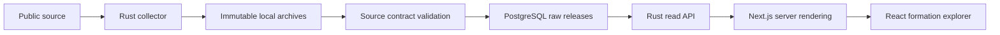

# Architecture

## Data flow

The executable data path is now a manual Rust collector: official JSONL exports,
immutable local archives, schema validation and atomic publication to PostgreSQL.
The Rust API reads descriptive data from published Parcoursup releases.
Next.js consumes its versioned HTTP contract and owns rendering and URL navigation.
The web shell, gallery and health endpoint remain independent of datasets.
Calculations, comparisons and scheduling are deferred.

## Ownership and boundaries

| Layer                             | Owns                                                      | Must not own                            |
| --------------------------------- | --------------------------------------------------------- | --------------------------------------- |
| `apps/web/src/app`                | Routes, layouts, route composition                        | Ingestion or analytics batch jobs       |
| `features/*/ui`                   | Feature presentation and interaction                      | Database connections                    |
| `features/*/domain`               | Pure URL/presentation rules and HTTP response validation  | Network, persistence                    |
| `features/*/server`, `src/server` | Server-only HTTP calls and upstream failure handling      | Client component state                  |
| `components`                      | Shared primitives and vendored UI                         | Feature-specific database queries       |
| `packages/db`                     | Schema, migrations, connection adapters                   | Product UI or Rust domain rules         |
| `crates/core`                     | Validated domain values and pure calculations             | SQLx, HTTP, async runtimes, filesystem  |
| `crates/api`                      | Axum routes, SQLx read repositories, formation read rules | Rendering, ingestion, schema migrations |
| `crates/aggregator`               | CLI, validated configuration, source/storage adapters     | A second migration history              |

Feature directories are created as needed. Empty layers are not placeholders.

`scripts/check-architecture.mjs` parses TypeScript imports and follows the runtime
graph from every `"use client"` entry, including aliases, barrels and literal
dynamic imports. It rejects server/database modules and nonliteral dynamic
imports in that graph. Type-only imports do not ship runtime dependencies.
Server entry points also import `server-only`, enforced by Next.js. A second
check follows imports from every web entry, including server modules, and rejects
database clients or schema imports. The web package has no database dependency.

The same check inspects Cargo metadata. Only Serde and thiserror are allowed
external dependencies of the pure domain crate; changing that allowlist requires
an architectural decision. Regression fixtures prove forbidden paths are caught.
Static analysis does not replace review of side effects or data semantics.

## Runtime interfaces

- `GET /formations` renders a server-side, 25-row formation page. GET parameters
  `campagne`, `q`, `type`, `region`, `departement`, `statut`, `selectivite`, and
  `page` encode its state. It calls `GET /v1/formations` on the Rust API.
- The Rust service provides `/health/live` and `/health/ready`. See the
  [HTTP contract](docs/api.md) for schemas, errors, timeouts and deployment limits.
- `GET /api/health` reports application liveness without opening a database.
  It is not a database readiness or dataset freshness check.
- `orvio-ingest doctor` validates the CLI runtime.
- `orvio-ingest doctor --database` checks a direct PostgreSQL connection.
- `just db-check` checks both Neon HTTP and Rust/SQLx.
- `orvio-ingest sources` lists the versioned registry offline.
- `orvio-ingest sync [--dataset <id>]` collects full datasets.
- `orvio-ingest replay --manifest <path>` loads a verified local archive.
- `orvio-ingest status` reports stored releases and latest run states.
- `/dev/ui` uses clearly labeled synthetic values. It calls `notFound()`
  outside development, and the home page removes its link.

The CLI writes structured JSON logs and sanitized errors. Network diagnostics
have bounded connection/query timeouts.

## Database

Drizzle is the only schema and migration owner. Both languages consume the same
PostgreSQL schema. Rust migrations and ad hoc production DDL are not permitted.

- `@orvio/db/neon`: Neon HTTP connectivity diagnostic only; not a web dependency.
- `@orvio/db/node`: bounded `pg` connections for tooling and local tests.
- `@orvio/db/migrate`: Drizzle SQL migration runner over a direct connection.
- `@orvio/db/schema`: datasets, immutable releases, raw records and ingestion runs.

No database is initialized during module evaluation or a build. Apply generated
Drizzle migrations explicitly before running ingestion. SQLx uses a dedicated
direct session per dataset for the advisory lock and COPY transaction. Readers
join through the current-release pointer, committed with the full release.
The API uses a bounded SQLx pool over the pooled URL and read-only transactions;
the collector keeps its dedicated direct connection.
See [ingestion](docs/ingestion.md) for schema, identity and archive contracts.

The web `formations` feature keeps pure URL/presentation rules and the validated
HTTP response contract under `domain`, the HTTP client under `server`, and
presentation under `ui`. Rust separates transport (`lib.rs`), pure formation
request/response rules (`formations/domain.rs`) and SQL reads
(`formations/repository.rs`). Future shared business calculations belong in
`orvio-core`; no empty shared abstraction is introduced.

A request captures a current release before querying that immutable release for
rows, facets and counts. SQL limits transferred results and preserves duplicate
rows. No persistent cache obscures publication changes. Builds do not read data.

Database and browser harnesses start the real Rust binary against an isolated
PostgreSQL 18 database seeded with labeled synthetic source records. The same
HTTP contract is used in development, production builds and tests. Neither the
API nor Next.js contains a fixture switch or fallback. The local supervisor and
browser harness remove database credentials from the web process environment.

## Hosting boundary

Cloudflare Workers is the planned website deployment target; the Rust service
needs a separate compatible host. No API hosting provider has been selected. This milestone uses
official Next.js locally and in CI. Adapter choice, runtime compatibility,
bindings, caching, secrets, and deployment are deferred to the hosting milestone.
See [decisions](docs/decisions.md) and [data contract](docs/data-contract.md).
