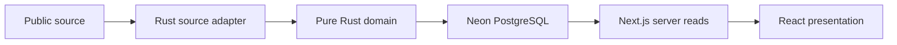

# Architecture

## Intended data flow

This diagram describes the intended product. Today the executable paths are the
web shell, development gallery, health endpoint, and database diagnostics.
There is no import job, business table, comparison API, or scheduled ingestion.

## Ownership and boundaries

| Layer                             | Owns                                                  | Must not own                           |
| --------------------------------- | ----------------------------------------------------- | -------------------------------------- |
| `apps/web/src/app`                | Routes, layouts, route composition                    | Ingestion or analytics batch jobs      |
| `features/*/ui`                   | Feature presentation and interaction                  | Database connections                   |
| `features/*/domain`               | Pure TypeScript presentation rules, when needed       | Network, persistence                   |
| `features/*/server`, `src/server` | Server-only reads and mapping to serializable data    | Client component state                 |
| `components`                      | Shared primitives and vendored UI                     | Feature-specific database queries      |
| `packages/db`                     | Schema, migrations, connection adapters               | Product UI or Rust domain rules        |
| `crates/core`                     | Validated domain values and pure calculations         | SQLx, HTTP, async runtimes, filesystem |
| `crates/aggregator`               | CLI, validated configuration, source/storage adapters | A second migration history             |

Feature directories are created as needed. Empty layers are not placeholders.

`scripts/check-architecture.mjs` parses TypeScript imports and follows the runtime
graph from every `"use client"` entry, including aliases, barrels and literal
dynamic imports. It rejects server/database modules and nonliteral dynamic
imports in that graph. Type-only imports do not ship runtime dependencies.
Server entry points also import `server-only`, enforced by Next.js.

The same check inspects Cargo metadata. Only Serde and thiserror are allowed
external dependencies of the pure domain crate; changing that allowlist requires
an architectural decision. Regression fixtures prove forbidden paths are caught.
Static analysis does not replace review of side effects or data semantics.

## Runtime interfaces

- `GET /api/health` reports application liveness without opening a database.
  It is not a database readiness or dataset freshness check.
- `orvio-ingest doctor` validates the CLI runtime.
- `orvio-ingest doctor --database` checks a direct PostgreSQL connection.
- `just db-check` checks both Neon HTTP and Rust/SQLx.
- `/dev/ui` uses clearly labeled synthetic values. It calls `notFound()`
  outside development, and the home page removes its link.

The CLI writes structured JSON logs and sanitized errors. Network diagnostics
have bounded connection/query timeouts.

## Database

Drizzle is the only schema and migration owner. Both languages consume the same
PostgreSQL schema. Rust migrations and ad hoc production DDL are not permitted.

- `@orvio/db/neon`: lazy Neon HTTP client for server reads, per-request timeout.
- `@orvio/db/node`: bounded `pg` connections for tooling and local tests.
- `@orvio/db/migrate`: Drizzle SQL migration runner over a direct connection.
- `@orvio/db/schema`: currently empty, with an empty migration journal.

No database is initialized during module evaluation or a build. The empty
migration journal is a no-op and creates no remote tables. Schema changes must
include reviewed generated SQL and integration evidence.

## Hosting boundary

Cloudflare Workers is the planned deployment target. This milestone uses
official Next.js locally and in CI. Adapter choice, runtime compatibility,
bindings, caching, secrets, and deployment are deferred to the hosting milestone.
See [decisions](docs/decisions.md) and [data contract](docs/data-contract.md).
