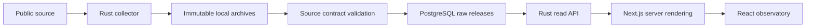

# Architecture

## Data flow

The executable data path is now a manual Rust collector: official JSONL exports,
immutable local archives, schema validation and atomic publication to PostgreSQL.
The Rust API reads published Parcoursup releases and computes reviewed indicators,
aggregate observations, specialty destinations and source coverage.
Next.js consumes its versioned HTTP contract and owns rendering and URL navigation.
The web shell, gallery and health endpoint remain independent of datasets.
Pure indicator representation belongs in `gradavia-core`; source-specific field
selection and read aggregation belong in the API. Scheduling remains deferred.

## Ownership and boundaries

| Layer                             | Owns                                                      | Must not own                            |
| --------------------------------- | --------------------------------------------------------- | --------------------------------------- |
| `apps/web/src/app`                | Routes, layouts, route composition                        | Ingestion or analytics batch jobs       |
| `features/*/ui`                   | Feature presentation and interaction                      | Database connections                    |
| `features/*/domain`               | Pure URL/presentation rules and HTTP response validation  | Network, persistence                    |
| `features/*/server`, `src/server` | Server-only HTTP calls and upstream failure handling      | Client component state                  |
| `components`                      | Shared primitives and vendored UI                         | Feature-specific database queries       |
| `packages/db`                     | Schema, migrations, connection adapters                   | Product UI or Rust domain rules         |
| `crates/core`                     | Validated domain values and pure calculations             | SQLx, HTTP, async runtimes, filesystem  |
| `crates/api`                      | Axum routes, SQLx read repositories, formation read rules | Rendering, ingestion, schema migrations |
| `crates/aggregator`               | CLI, validated configuration, source/storage adapters     | A second migration history              |

Feature directories are created as needed. Empty layers are not placeholders.

`scripts/check-architecture.mjs` parses TypeScript imports and follows the runtime
graph from every `"use client"` entry, including aliases, barrels and literal
dynamic imports. It rejects server/database modules and nonliteral dynamic
imports in that graph. Type-only imports do not ship runtime dependencies.
Server entry points also import `server-only`, enforced by Next.js. A second
check follows imports from every web entry, including server modules, and rejects
database clients or schema imports. The web package has no database dependency.

The same check inspects Cargo metadata. Only Serde and thiserror are allowed
external dependencies of the pure domain crate; changing that allowlist requires
an architectural decision. Regression fixtures prove forbidden paths are caught.
Static analysis does not replace review of side effects or data semantics.

## Runtime interfaces

- `GET /formations` renders a 25-row search page. `campagne`, `q`, `type`,
  `region`, `departement`, `statut`, `selectivite`, `tri` and `page` encode its
  API query; `vue` selects the client presentation. It calls `/v1/formations`.
- `/` introduces the product with independent server-rendered content and a
  streamed preview from `/v1/overview`. Loading uses inert placeholders;
  empty/unavailable data uses a non-numeric search/navigation panel.
  Legacy `/?campagne=YYYY` links redirect to `/observatoire?campagne=YYYY`.
- `/observatoire` and `/territoires` consume `/v1/overview`; each headline, breakdown and
  coverage value uses the same selected immutable campaign release.
- `/formations/[id]` reads a retained `release:row` identity, source-defined
  indicators and separately qualified history. Retained links survive imports.
- `/comparer` reads at most four formations, requires one campaign and exposes
  exact metric states. `/favoris` resolves saved identities through the same API.
- `/specialites` uses the separately reviewed 2025 general-baccalaureate
  specialty dataset. National, group and formation levels stay separate.
- `/sources` reads the 14-source inventory and explains metric definitions,
  population differences, history limits and local selection persistence.
- The Rust service provides `/health/live` and `/health/ready`. See the
  [HTTP contract](docs/api.md) for schemas, errors, timeouts and deployment limits.
- `GET /api/health` reports application liveness without opening a database.
  It is not a database readiness or dataset freshness check.
- `gradavia-ingest doctor` validates the CLI runtime.
- `gradavia-ingest doctor --database` checks a direct PostgreSQL connection.
- `just db-check` checks both Neon HTTP and Rust/SQLx.
- `gradavia-ingest sources` lists the versioned registry offline.
- `gradavia-ingest sync [--dataset <id>]` collects full datasets.
- `gradavia-ingest replay --manifest <path>` loads a verified local archive.
- `gradavia-ingest status` reports stored releases and latest run states.
- `/dev/ui` uses clearly labeled synthetic values. It calls `notFound()`
  outside development, and the home page removes its link. Loading boundaries
  are scoped to data routes; there is no root loading fallback that could stream
  a 200 response before this production 404 is decided.

The CLI writes structured JSON logs and sanitized errors. Network diagnostics
have bounded connection/query timeouts.

## Database

Drizzle is the only schema and migration owner. Both languages consume the same
PostgreSQL schema. Rust migrations and ad hoc production DDL are not permitted.

- `@gradavia/db/neon`: Neon HTTP connectivity diagnostic only; not a web dependency.
- `@gradavia/db/node`: bounded `pg` connections for tooling and local tests.
- `@gradavia/db/migrate`: Drizzle SQL migration runner over a direct connection.
- `@gradavia/db/schema`: datasets, immutable releases, raw records and ingestion runs.

No database is initialized during module evaluation or a build. Apply generated
Drizzle migrations explicitly before running ingestion. SQLx uses a dedicated
direct session per dataset for the advisory lock and COPY transaction. Readers
join through the current-release pointer, committed with the full release.
The API uses a bounded SQLx pool over the pooled URL and read-only transactions;
the collector keeps its dedicated direct connection.
See [ingestion](docs/ingestion.md) for schema, identity and archive contracts.

### Campaign atlas and preparation workspace

`features/atlas` consumes a separate compact Rust projection of one immutable
campaign, bounded to 30,000 source rows. Numeric values and explicit non-observed
states travel together; definitions and provenance travel once per snapshot.
Parcoursup, apprenticeship and APB have distinct adapters and definitions. The
original paginated formation contract remains compatible. Geographic exploration
and `features/analysis` derive their linked views from the same captured snapshot;
no tile provider supplies admissions observations. Leaflet renders published
coordinates and OpenStreetMap supplies only the basemap.

Extended detail reads retain honors, source-specific candidate profiles,
recruitment fields, actual offer milestones and rank groups. A formation page
computes its peer summary on the server and sends only that summary to the UI.
Peer similarity is descriptive and is not an admissions or curriculum model.

Local preparation extends the existing bounded selection store with named lists,
notes, status and source-aware snapshots. Shared links omit notes by default;
explicitly shared annotations use the URL fragment. The printable dossier makes
snapshot coverage visible. `features/budget` stores optional user-entered cost
scenarios separately and never introduces inferred city prices.

The public dataset/export route calls the Rust service through the existing
server-only transport. It accepts bounded dataset selectors and fixed export
formats, never SQL, filesystem paths or an arbitrary upstream URL. The Rust
service remains private in Cloudflare. See [analysis methodology](docs/analysis-methodology.md)
for aggregation, saved views and comparison rules.

The web `formations` feature keeps pure URL/presentation rules and the validated
HTTP response contract under `domain`, the HTTP client under `server`, and
presentation under `ui`. Rust separates transport (`lib.rs`), pure formation
request/response rules (`formations/domain.rs`) and SQL reads
(`formations/repository.rs`). Future shared business calculations belong in
`gradavia-core`; no empty shared abstraction is introduced.

A request captures a current release before querying that immutable release for
rows, facets and counts. SQL limits transferred results and preserves duplicate
rows. Bounded in-memory overview and historical-summary caches are keyed by all
captured immutable source/provenance records. The overview key also includes the
selected campaign. Every request checks current pointers before lookup;
publication changes invalidate the keys. Historical
observations are aggregated in one database query. Builds do not read data.

Database and browser harnesses start the real Rust binary against an isolated
PostgreSQL 18 database seeded with labeled synthetic source records. The same
HTTP contract is used in development, production builds and tests. Neither the
API nor Next.js contains a fixture switch or fallback. The local supervisor and
browser harness remove database credentials from the web process environment.

## Hosting boundary

The Cloudflare deployment uses Workers for the official Next.js production
output through OpenNext. The web Worker calls a private service binding to a second Worker, which runs the
existing Axum/SQLx binary in a Cloudflare Container. The API Worker has no public
route. Only the container receives its runtime database secret; image and web
builds remain credential-free. Ordinary local development and CI still run
official Next.js and the Rust binary directly.

The initial container count is bounded and idle shutdown is configured.
`gradavia.com` is the canonical web domain. See [deployment](docs/deployment.md)
for account prerequisites, production credentials and verified release evidence.
GitHub Actions gates main releases on the full verification job, serializes
production publication and checks the public data path afterward. The deployment
token is isolated from verification/builds; the database secret stays in Cloudflare.
See [decisions](docs/decisions.md) and [data contract](docs/data-contract.md).

## Client state and visualization

Shared beUI sources remain under `components/motion`; Tremor chart sources and
licenses remain under `components/charts/tremor`. `features/navigation/ui`
owns the responsive app shell and command palette. `features/observatory`
separates overview/source contracts, server loading and interactive charts.
`features/specialties` owns the distinct specialty population and UI.
`features/landing/ui` owns the homepage composition and preview. The shared
application shell excludes only `/`; product routes and error pages retain it.
The landing reuses global theme, selection persistence and reduced-motion
providers. Its search uses a native GET form; campaign controls stay scoped to
their exploration route. Viewport-height sections, document scroll snapping and
smooth native fragment links stay scoped to the landing's presence. Content can
grow beyond a viewport; no wheel, touch or keyboard event interception is added.

Browser-local storage contains explicitly selected formation IDs, campaign,
display labels, bounded source snapshots, named lists and user-entered notes/status.
It is schema-validated, bounded, versioned and synchronized
between tabs; storage failure degrades to the current tab with a visible notice.
No account, user profile backend or individual admission prediction is added.
Selections saved before the rename remain readable through the legacy
`orvio.selection.v1` key. Writes use `gradavia.selection.v1`, which takes
precedence even when empty. This compatibility applies within the same browser
origin; it does not transfer local storage between domains.
CSV generation preserves missingness and provenance and neutralizes spreadsheet
formula prefixes. Chart values have table equivalents and filters have
keyboard-accessible controls; Motion respects reduced motion.
